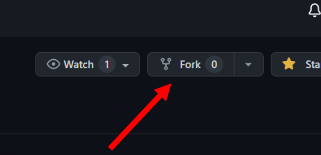
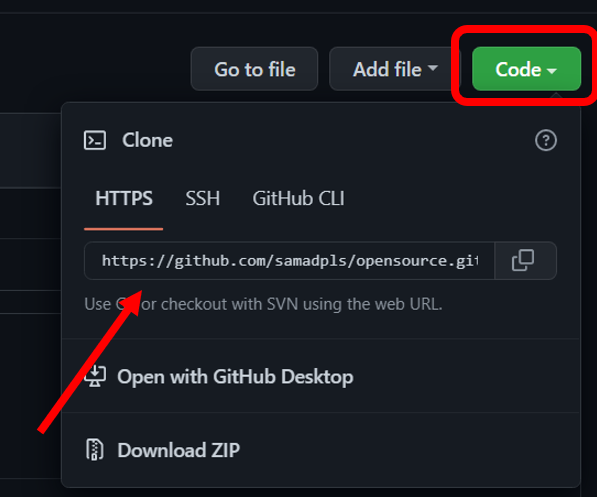
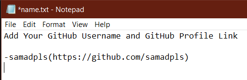
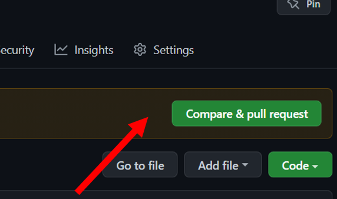
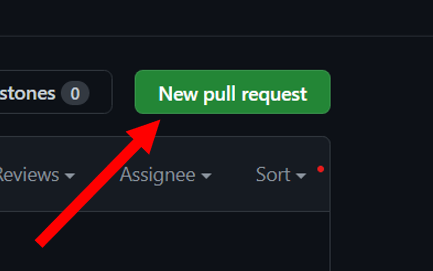

# Open Source Contribution 

 
 


This repository will guide you through the process of contributing to open source on GitHub.

## Install Git 

Click [](https://git-scm.com/downloads) to install Git on your machine.

### Git Setup
To avoid any errors, follow these steps after installing Git:
1. Open a terminal and run the following command to set your Github username:
```ruby
git config --global user.name "username"
```
2. Set your Github email with the following command:
```ruby
git config --global user.email "email@example.com"
```

## Fork the Repository
Fork this repository by clicking the fork button. This will create a copy of the repository in your own account.<br>
  
2. Go to your account and open the forked repository. Click on the code button to copy the link.  
  
3. Run the following command to clone the repository to your machine:  

**Example**
``` ruby
git clone https://github.com/your-username/opensource.git
```

4. Change the directory to the newly cloned repository:
```ruby
cd opensource
```

## Create a Branch
It is best practice to create a new branch. Run the following command in the terminal:

```ruby
git switch -c anyname
```

### Open the name.md File
While still in the terminal, open the `name.md` file (located inside the opensource folder).
1. Add your username and Github profile link to the `name.md` file. 
2. Save the file and go back to the terminal.
3. Run the following command to stage the changes:

### Example
<br>
```ruby
git add .
```
4. Commit the changes with a descriptive message, using your username:

make sure to use **"commas "** after -m
```ruby
git commit -m "added (username) in the name.txt"
```
### Example:
```ruby
git commit -m "added (samadpls) in the name.txt"
```
5. Push the changes to the remote branch with the following command:

#### Finally 
```ruby
git push origin -u your-branch-name
```
If the above command gives an error, run the following command instead:
```ruby
git config --global push.autoSetupRemote true
```

**if error not resolve watch this video**
<a href='https://www.youtube.com/watch?v=ozFv4oclQdE&t=612s'>YouTube</a>
## Submit a Pull Request
Go to your Github account and you will see the option to create a pull request. Merge the changes into your repository and then create a pull request.  
<br>
After merging it in your repository, open my repository again and create a pull request by going on the pull request option, then you will see this option<br>  
  
<br><br>
<br>
set dropdown compare option and select your repo, and send pull request.<br><br>


<em>Congratulations, you now know how to contribute to open source!</em>

| **Contributor**|
|---|
||
 
 
**If you stuck somewhere or getting any error you can also check the YouTube video**<br>
<a href='https://www.youtube.com/watch?v=ozFv4oclQdE&feature=youtu.be'>HELP</a><br>

<br>
Inspired by <a href='https://github.com/firstcontributions/first-contributions'>First-contribution</a>


